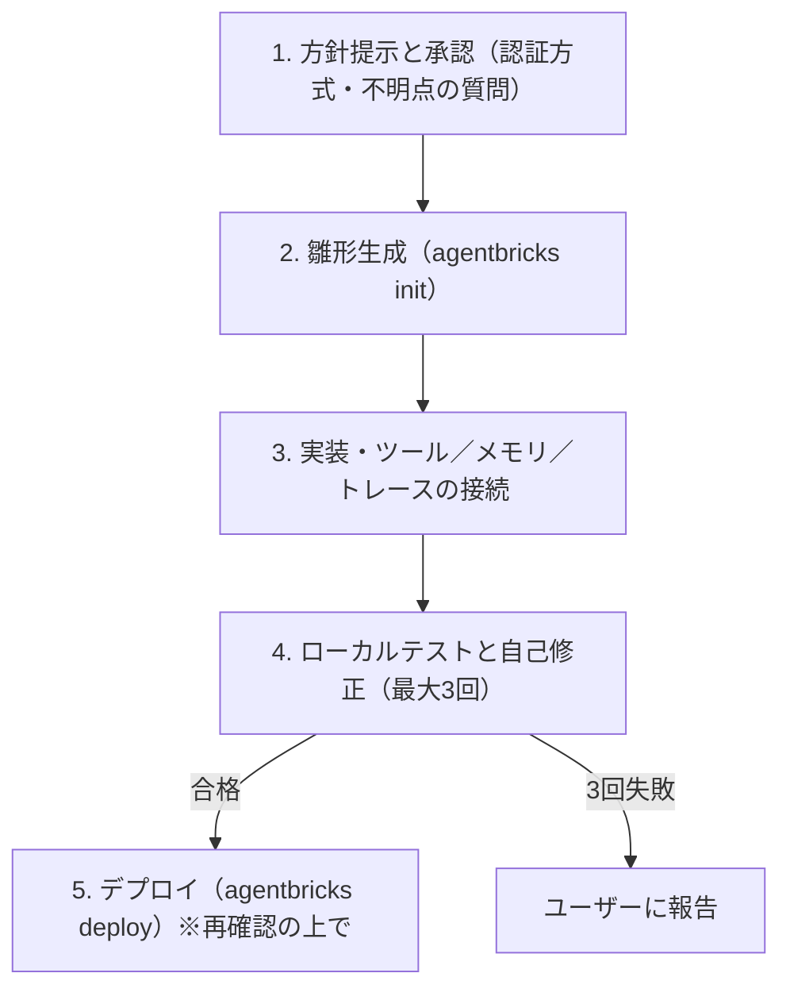
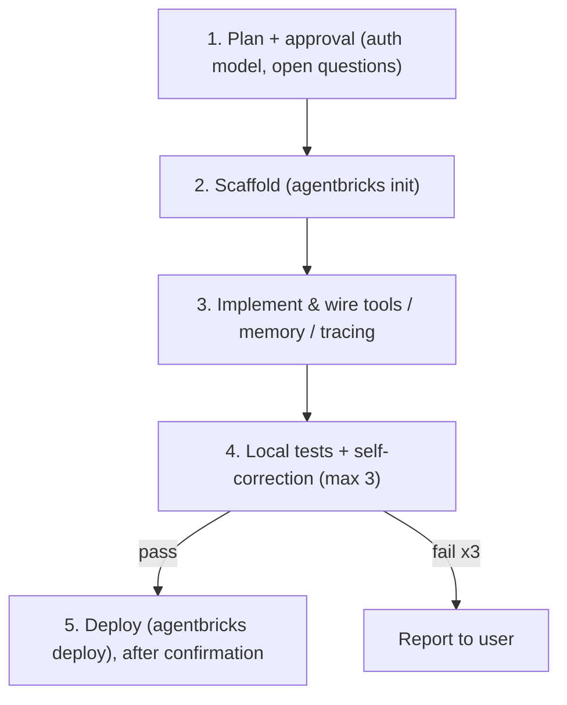

# Databricks Native Agent Skill (`databricks-native-agent`)

[日本語](#日本語) | [English](#english)

---

# 日本語

コーディングエージェント（Claude Code、Antigravity / Gemini CLI）が、要件から **テスト済みで、デプロイ済みの Databricks AI エージェント** までを一貫して進めるための
[Agent Skill](https://code.claude.com/docs/en/skills) です。Agent Bricks CLI（`agentbricks`、パッケージ名 `databricks-agentbricks`）と Databricks Apps を使います。

作りたいエージェントを説明すると、スキルが次の手順で進めます。

1. **最初に方針を提示して確認します。** 必要な情報を読み取り専用で調べ、方針を示して承認を求めます。方針には **各リソースの認証方式**（既定は、エンドユーザーとして実行する OBO）と、仕様が不明確な点への質問を含みます。承認するまで何も作成しません。
2. **雛形を生成します。** `agentbricks init` で作成し、テンプレートを自動で補正します。
3. **実装とツールの接続をします。** Unity Catalog 関数、Genie、マネージド MCP、Python サンドボックス、ローカルツール、Lakebase のメモリ／セッションストア、MLflow トレースを接続します。
4. **ローカルでテストします。** 自動 API テストは、まず「対象が自分のエージェントであること」を確認します。失敗した場合は自己修正ループ（最大3回）に進み、解決しなければあなたに報告します。
5. **デプロイします。** `agentbricks deploy` で Databricks Apps にデプロイします。クラウドのリソースや権限を作成するため、ここでも改めて確認します。



## インストール

必要なもの: Python 3.11 以上、[uv](https://docs.astral.sh/uv/)、認証済みプロファイル付きの
[Databricks CLI](https://docs.databricks.com/aws/en/dev-tools/cli/install)（`databricks auth profiles` で確認）、
`uv pip install "databricks-agentbricks[langgraph]"`。
`pip` ではなく `uv` を使ってください（`pip` のリゾルバは、これらのパッケージで `ResolutionTooDeep` になることがあります）。

**インストール先にしたいプロジェクト**で実行します（`--project` は現在のディレクトリが対象です）。
`<skill-dir>` はこのフォルダのパスです（このリポジトリのクローン内では `.agents/skills/databricks-native-agent`）。

```bash
# Claude Code・このプロジェクトのみ    -> ./.claude/skills/databricks-native-agent
bash <skill-dir>/scripts/install_skill.sh --claude --project
# Claude Code・全プロジェクト          -> ~/.claude/skills/
bash <skill-dir>/scripts/install_skill.sh --claude
# Antigravity / Gemini CLI            -> ~/.gemini/antigravity-cli/skills/   （--project を付けると ./.agents/skills）
bash <skill-dir>/scripts/install_skill.sh
```

インストーラはスキルのフォルダへのリンクを作ります。Claude Code は `SKILL.md` からスキルを検出するので、`CLAUDE.md` はインストールされません。

### Windows

- **推奨は WSL2** です。プロジェクトは `/mnt/c` ではなく WSL のファイルシステム（`~/...`）に置いてください（`.venv` の作成が非常に遅くなります）。
- **ネイティブ Windows**（管理者権限も bash も不要）: ジャンクションを作成します。`-Copy` を付けるとコピーします。
  ```powershell
  powershell -ExecutionPolicy Bypass -File <skill-dir>\scripts\install_skill.ps1 -Claude -Project
  ```
  ドキュメントの `python3` は、Windows では `py -3` か `python` に読み替えてください。ネイティブ Windows での `agentbricks` と `uv` の動作は、ここでは検証していません。
- このリポジトリの `skills/` と `.claude/skills/` はシンボリックリンクで、Windows では `git clone` で復元されないことがあります。インストーラを使ってください。

## 使い方

Claude Code では、普通の言葉で依頼するか、スキルを明示的に呼び出します。

```text
/databricks-native-agent DataAI関連の質問に、社内ナレッジ(Lakebase)を参照して答え、無ければWeb検索するエージェントを作って
```

エージェントは、何かを作成する前に方針を提示し、あなたの承認を待ちます。

## 同梱物

```text
databricks-native-agent/                      # <skill-dir>
├── README.md  .gitignore
├── SKILL.md                      # ワークフロー（唯一の正本）
├── scripts/
│   ├── check_environment.py      # 前提条件、WSL/NTFS の警告、--port <p> の使用者確認（Win/Linux/macOS）
│   ├── verify_and_patch_project.py  # 雛形の補正、古いテンプレートテストの警告
│   ├── run_local_api_test.py     # ローカル API テスト。--project <dir> で身元確認を追加
│   ├── install_skill.sh          # bash 用インストーラ（--claude、--project、--global）
│   └── install_skill.ps1         # PowerShell 用インストーラ（-Claude、-Project、-Copy）
└── references/                   # CLI リファレンス、agent.toml 仕様、ツール／セキュリティ、テスト・デプロイガイド
```

このスキルで作った例（元のリポジトリではスキルの隣にあります）: `dataai-knowledge-agent/`（Lakebase のナレッジを優先し、Web 検索にフォールバック。OBO、メモリ、MLflow トレース付き）と `databricks-smart-agent/`。

## 設計上の要点

- **OBO を基本とします。** リソースはエンドユーザーとしてアクセスするため、UC や Postgres の権限がユーザーごとに効き、アプリのサービスプリンシパルにデータへの常時権限を与えません。アプリのサービスプリンシパルを使うのは共有インフラ（埋め込みエンドポイントや実行状態のストアなど）だけで、どこで使うかは方針の提示時に明示します。権限が足りない場合は、クラッシュさせずに `ACCESS_DENIED` として（使った身元と理由を添えて）ユーザーに返します。
- **テストは身元の確認から始めます。** ポートに古いサーバーが残っていると、汎用テストが通ってしまいます。`run_local_api_test.py --project <dir>` は、まずポートの持ち主と、エージェントが名乗るツールを確認します。
- **既知の落とし穴を、スキルの Gotchas 表に取り込んでいます。** ポートの衝突、`agentbricks dev` と `.venv`、`--profile` はグローバルオプションのみ（`agentbricks --profile <p> deploy ...`）、Claude が拒否する MCP の `id` フィールド、ツール失敗で壊れるセッション履歴、スコープ追加後の再同意、アプリ名30文字の制限などです。

## チェックを手動で実行する

パスは `<skill-dir>` からの相対です。`agentbricks dev` はプロジェクトのディレクトリで実行します。

```bash
python scripts/check_environment.py --port 8010
agentbricks --profile <profile> dev --app-port 8010          # プロジェクトのディレクトリで
python scripts/run_local_api_test.py \
  --url http://localhost:8010 --project <project_dir> --custom-query "あなたの業務の質問"
```

## コントリビュート

ワークフローのルールは `SKILL.md` と `references/` だけに書きます。リポジトリ直下の `CLAUDE.md`（このフォルダの外）は、開発者向けのメモで、配布するスキルには含まれません。スクリプトを変更したら、上のコマンドで実際のプロジェクトに対して検証してください。

---

# English

An [Agent Skill](https://code.claude.com/docs/en/skills) that lets a coding agent (Claude Code, Antigravity / Gemini CLI)
take you from a requirement to a **tested, deployed Databricks AI agent**, using the Agent Bricks CLI
(`agentbricks`, package `databricks-agentbricks`) and Databricks Apps.

You describe the agent; the skill drives a guarded workflow:

1. **Plan and ask first.** The agent inspects what it needs (read-only), then presents the approach and asks you
   to approve it. This includes **how every resource is authenticated** (default: on behalf of the end user, OBO)
   and any under-specified points. Nothing is created before you say go.
2. **Scaffold** with `agentbricks init`, then auto-patch the template.
3. **Implement and wire** tools: Unity Catalog functions, Genie, managed MCP, Python sandbox, local tools,
   Lakebase memory / session store, MLflow tracing.
4. **Test locally** with an automated API suite that first proves it is talking to *your* agent, followed by a
   bounded self-correction loop (max 3 iterations, then it escalates to you).
5. **Deploy** to Databricks Apps with `agentbricks deploy` (asks for confirmation again, since it creates cloud
   resources and grants).



## Install

Requirements: Python >= 3.11, [uv](https://docs.astral.sh/uv/), the
[Databricks CLI](https://docs.databricks.com/aws/en/dev-tools/cli/install) with an authenticated profile
(`databricks auth profiles`), and `uv pip install "databricks-agentbricks[langgraph]"`.
Use `uv`, not plain `pip` (pip's resolver can hit `ResolutionTooDeep` on these packages).

Run these from the **project you want to install into** (`--project` targets the current directory), using the
path to this folder (shown here as `<skill-dir>`; inside a clone of this repo it is `.agents/skills/databricks-native-agent`):

```bash
# Claude Code, this project only      -> ./.claude/skills/databricks-native-agent
bash <skill-dir>/scripts/install_skill.sh --claude --project
# Claude Code, all projects           -> ~/.claude/skills/
bash <skill-dir>/scripts/install_skill.sh --claude
# Antigravity / Gemini CLI            -> ~/.gemini/antigravity-cli/skills/   (add --project for ./.agents/skills)
bash <skill-dir>/scripts/install_skill.sh
```

The installer links the skill directory; Claude Code discovers it from `SKILL.md`, so no `CLAUDE.md` is installed.

### Windows

- **Recommended: WSL2**, with the project on the WSL filesystem (`~/...`), not `/mnt/c` (slow `.venv` builds).
- **Native Windows** (no admin rights, no bash): creates a junction, or copies with `-Copy`.
  ```powershell
  powershell -ExecutionPolicy Bypass -File <skill-dir>\scripts\install_skill.ps1 -Claude -Project
  ```
  Use `py -3` or `python` where docs say `python3`. `agentbricks` / `uv` on native Windows are not verified here.
- The repo's `skills/` and `.claude/skills/` are symlinks that `git clone` may not restore on Windows; use the installer.

## Use

In Claude Code, ask in plain language, or call the skill explicitly:

```text
/databricks-native-agent DataAI関連の質問に、社内ナレッジ(Lakebase)を参照して答え、無ければWeb検索するエージェントを作って
```

The agent will present a plan and wait for your approval before touching anything.

## What is in the box

```text
databricks-native-agent/                      # <skill-dir>
├── README.md  .gitignore
├── SKILL.md                      # the workflow (single source of truth)
├── scripts/
│   ├── check_environment.py      # prerequisites, WSL/NTFS warning, --port <p> owner check (Win/Linux/macOS)
│   ├── verify_and_patch_project.py  # fixes the scaffold; warns about stale template tests
│   ├── run_local_api_test.py     # local API suite; --project <dir> adds the identity check
│   ├── install_skill.sh          # bash installer (--claude, --project, --global)
│   └── install_skill.ps1         # PowerShell installer (-Claude, -Project, -Copy)
└── references/                   # CLI reference, agent.toml spec, tools/security guide, test & deploy guide
```

Examples produced with the skill (kept next to the skill in the source repo): `dataai-knowledge-agent/` (Lakebase knowledge base first,
web search as fallback, OBO access, memory + MLflow tracing) and `databricks-smart-agent/`.

## Design choices worth knowing

- **OBO by default.** Resources are accessed as the end user, so UC / Postgres grants apply per user and the app
  service principal needs no standing data access. The app SP is used only for shared infrastructure (e.g. embedding
  endpoints, runtime stores), and the plan states where. Missing permission is returned to the user as an
  `ACCESS_DENIED` message (with identity and reason), not a crash.
- **Tests must prove identity.** A stale server on the port can satisfy generic tests, so
  `run_local_api_test.py --project <dir>` checks the port owner and the reported tools first.
- **Known pitfalls are encoded** in the skill's Gotchas table: port collisions, `agentbricks dev` and `.venv`,
  `--profile` only accepted globally (`agentbricks --profile <p> deploy ...`), MCP `id` fields rejected by Claude,
  session history poisoned by a crashed tool call, scope re-consent after adding scopes, 30-character app-name limit.

## Run the checks manually

Paths are relative to `<skill-dir>`; `agentbricks dev` runs in the project directory.

```bash
python scripts/check_environment.py --port 8010
agentbricks --profile <profile> dev --app-port 8010          # in the project directory
python scripts/run_local_api_test.py \
  --url http://localhost:8010 --project <project_dir> --custom-query "your domain question"
```

## Contributing

`SKILL.md` and `references/` are the only place for workflow rules; the repository-level `CLAUDE.md` (outside this folder) is a contributor note, not part
of the distributed skill. Verify script changes against a real project with the commands above.
