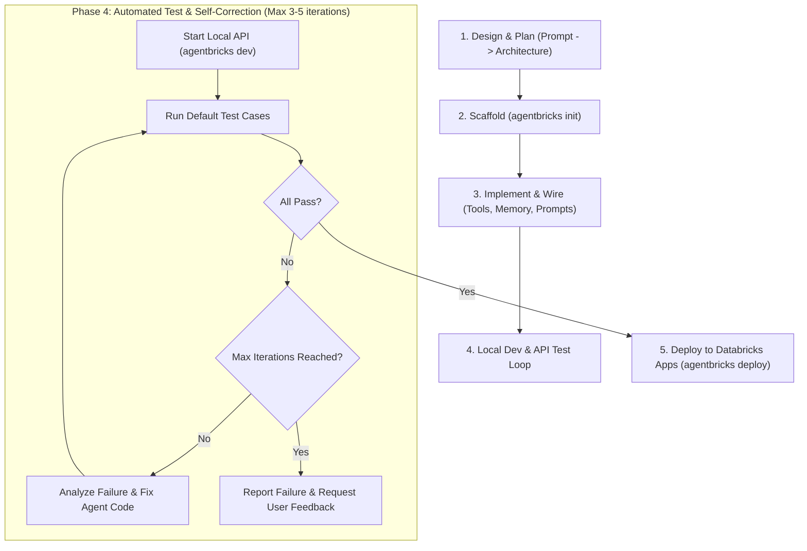

# Databricks Native Agent Development Guide (`agentbricks`)

This skill guides the end-to-end lifecycle for developing, locally testing, and deploying custom Databricks-native AI agents using the **Agent Bricks CLI** (`agentbricks` / `databricks-agentbricks`).

Follow this 5-phase workflow, featuring an **automated local API test suite and bounded self-correction loop** before deploying to Databricks Apps.



---

## Prerequisites Check

Before starting, verify the environment:
1. **Python**: Python `>= 3.11`
2. **uv (Required)**: Fast package manager to avoid pip backtracking errors (`curl -LsSf https://astral.sh/uv/install.sh | sh`).
3. **Databricks CLI**: Configured with an active authentication profile (`databricks auth profiles`).
4. **Agent Bricks CLI & LangGraph**:
   ```bash
   uv pip install "databricks-agentbricks[langgraph]" pytest pytest-asyncio
   ```
   > [!WARNING]
   > Do **NOT** use standard `pip install` without constraints for LangGraph dependencies; pip's resolver can encounter deep backtracking loops (`ResolutionTooDeep`). Always use `uv pip install`.

> [!NOTE]
> On native Windows use `py -3` or `python` wherever this guide says `python3` (the Store stub does not count).

Run the prerequisite check helper:
```bash
python .agents/skills/databricks-native-agent/scripts/check_environment.py
```

---

## Phase 1: Requirements Definition & Architecture Design

> [!IMPORTANT]
> **Human approval gate (mandatory).** Do NOT run `agentbricks init` or touch the workspace until the
> user has approved the plan below. This phase ends with a question to the user, not with code.

1. **Gather facts first (read-only)**: inspect referenced resources (e.g. Lakebase schema, UC objects,
   Genie spaces, available models/MCP services via `agentbricks tools list`) so the plan is concrete.
2. **Present a plan and ask for go/no-go.** Keep it short and include:
   - **Goal & behavior**: what the agent does and the answer flow (e.g. "KB first, then web search").
   - **Architecture**: framework, model, tools/MCP/Genie/UC functions, memory / session store, MLflow tracing.
   - **Authentication to each resource** (required): default is **OBO — the end user's identity**. For every
     resource the agent touches (Lakebase/Postgres, UC tables & functions, Genie, MCP, vector search, SQL...)
     state: which identity is used (OBO user vs. app service principal), the user-API **scopes** it needs
     (e.g. `postgres`, `sql`, `genie`, `files`, `ai-gateway`), what **each user must already have** (Postgres role
     + grants, UC privileges), and what happens when access is missing. Name any resource where you propose the
     app SP instead (e.g. model-serving embeddings, checkpoint/memory stores) and why. See "Resource
     authentication (OBO by default)" below.
   - **Assumptions & defaults you picked** (project name, profile, model, thresholds), each marked as changeable.
   - **Steps & side effects**: what will be created locally vs. in the workspace (stores, apps, grants), and
     what is deferred until after local tests (deployment).
   - **Risks / known gotchas** relevant to this design.
3. **Ask about anything under-specified — do not guess.** Use the AskUserQuestion tool (or a short list)
   for items such as: data sources/tables to use, language and answer format, any exception to the OBO default (which resources would use the app SP),
   which profile/workspace, naming, cost-affecting settings, anything that touches shared resources.
   Offer a recommended default for each question.
4. **Wait for explicit approval** (and answers) before Phase 2. Re-ask if the user's answers change the plan.
   Deployment (Phase 5) needs its own confirmation, since it creates cloud resources and grants.

### Resource authentication (OBO by default)

- **Default = OBO**: access every user-owned or governed resource as the end user, so UC/Postgres grants
  apply per user and the app service principal (SP) needs no standing access to the data.
- Use the **app SP** only for shared infrastructure that is not user data (e.g. embedding/model endpoints,
  the runtime/session/memory stores Agent Bricks provisions). Tell the user which parts use the SP.
- **Declared tools** (`agentbricks tools add ... --auth user`) are OBO; `deploy --allow-user-scope-update` adds
  the scopes it knows (`ai-gateway`, `genie`, `sql`, `files`). **Local Python tools are not covered**: build
  them per request with the runtime's `workspace_client_for("user")` (see `adapter.py` / `agent.py`) and add
  scopes the CLI does not know yourself (e.g. `postgres`):
  `databricks apps create-update <app> --json '{"update_mask":"user_api_scopes","app":{"user_api_scopes":[...]}}'`
  (scopes are never removed automatically; users may need to re-consent).
- **Postgres/Lakebase via OBO** needs the `postgres` scope and a Postgres role for each user; do not give
  `databricks_superuser` to OBO users (it bypasses RLS). No app `postgres` resource or SP `GRANT` is needed.
- **Missing permission must not be a crash**: catch permission errors (`PermissionDenied`, Postgres
  `permission denied` / `role ... does not exist`) and return an `ACCESS_DENIED` message telling the user the
  information could not be retrieved for lack of permission; instruct the model (system prompt) to say so
  plainly and not to pass off other sources as that resource.
- **Never swallow the reason for a denial.** Return it in the `ACCESS_DENIED` text (which identity was used —
  request-user vs app SP — and the error reason, truncated) and also `logger.warning` it, otherwise a scope or
  role problem is impossible to diagnose from the browser or the app logs.
- **Re-consent after adding a scope.** A user's forwarded token only carries the scopes they consented to at
  login. Scopes added later (e.g. `postgres`) are missing from existing sessions: users get `ACCESS_DENIED`
  until they sign out / open the app in a private window and consent again. Tell users this at rollout.
  A CLI token (`databricks auth token`) has broad scope, so a CLI-based test can pass while the browser fails —
  verify with a real browser login.
- Limits of request-user invocations: no approval/resume (HITL) and no background recovery.
- Locally there is no end-user token, so OBO falls back to your CLI profile identity; verify OBO behaviour on
  the deployed app (e.g. call it with `databricks auth token` as a Bearer token).

Design checklist:
1. **Framework**:
   - **LangGraph** (Default): Multi-step graphs, state machines, complex branching.
   - **OpenAI Agents SDK**: Single/multi-agent tool calling with standard session history.
2. **Databricks Native Integrations**:
   - **Unity Catalog Tools**: SQL functions (`catalog.schema.function`)
   - **Python Sandbox**: Code interpreter downscoped to specific tables/volumes
   - **Managed MCP Services**: External tools integrated via MCP
   - **Lakebase Managed Memory**: Long-term memory across sessions
   - **Lakebase Session Store**: Persistent conversation transcript
   - **MLflow Tracing**: Production trace collection in Unity Catalog

---

## Phase 2: Project Scaffolding (`agentbricks init`)

1. Scaffold a clean project template:
   ```bash
   # LangGraph + Chat UI (default)
   agentbricks init <project_name> --profile <databricks_profile>
   ```

2. **Run Post-Init Verification & Auto-Patching**:
   Immediately run the project patcher helper to ensure entrypoints and environment settings are ready:
   ```bash
   python .agents/skills/databricks-native-agent/scripts/verify_and_patch_project.py <project_name>
   ```
   This automatically verifies:
   - `runtime/main.py` has an executable `if __name__ == "__main__": main()` block.
   - `.env` contains valid Databricks profile / authentication settings.

3. Verify the generated project structure:
   - `agent.toml`: Manifest for framework, tools, stores, and tracing
   - `app.yaml`: Databricks Apps runtime manifest
   - `.env`: Profile authentication settings
   - `agent/agent.py`: Agent execution definition
   - `runtime/`: Durable server adapter
   - `ui/`: Web chat interface

---

## Phase 3: Agent Implementation & Tool Wiring

1. **System Prompt & LLM Selection (`agent/agent.py`)**:
   Configure system instructions tailored to the user's domain. Select a Databricks Foundation Model (e.g. `system.ai.claude-sonnet-4-5`, `databricks-meta-llama-3-3-70b-instruct`).
2. **Bind Native Databricks Tools**:
   ```bash
   # Unity Catalog Function
   agentbricks tools add uc-function <tool_id> --function catalog.schema.func
   
   # Secure Sandbox with downscoped access
   agentbricks tools add sandbox python_analyst --downscope table:catalog.schema.table:read_only
   
   # MCP Service / Genie
   agentbricks tools add mcp <tool_id> --service <service_name>
   agentbricks tools add genie <tool_id> --space-id <space_id>

   # Managed Memory & Session
   agentbricks memory bind <name>-memory
   agentbricks sessions bind <name>-sessions
   agentbricks tracing bind /Users/<user>/agentbricks-<name>
   ```
3. **Local Custom Tools**: Add local Python tools in `agent/tools/` if needed.
4. **If you delete the template sample tools** (`sample_tool.py`, `send_message.py`), also update
   `agent/agent.py` (`REQUIRE_APPROVAL` references `send_message`) and `tests/test_agent.py`
   (`test_tools_autoregister`, `test_gated_tool_is_in_require_approval` assert those tools exist),
   otherwise `uv run pytest` fails. `verify_and_patch_project.py` warns about this.
5. **Managed MCP tools with Claude models**: MCP results (e.g. `system.ai.web_search`) can carry an `id`
   on text content blocks, which Claude rejects (`tool_result.content.0.text.id: Extra inputs are not
   permitted`, surfaced as HTTP 500). Strip it with an `AgentMiddleware.awrap_tool_call` that removes `id`
   from `ToolMessage.content` blocks.

---

## Phase 4: Local Testing & Automated Self-Correction Loop

To guarantee agent quality before deployment, run an automated API test suite against the local development server with a bounded retry loop.

### Server & Endpoint Specification:
- **Server**: Agent Bricks uses `DurableAgentServer` by default.
- **Endpoint**: `POST /api/invocations` (Idempotent UUID `id`, session context in `input.session_id`).
- **Standard Invocations**: Fallback support for `/invocations` (Model Serving format). The test suite automatically detects the active endpoint!

### Automated Test & Improvement Loop Rules:
1. **Pre-flight**: `python .agents/skills/databricks-native-agent/scripts/check_environment.py --port 8000`
   (reports who owns the port and warns when the project lives on WSL's `/mnt/c`).
   **A stale server on the port makes every test "pass" against the wrong agent.**
2. **Launch Local Server** on a port you verified is free, and note both ports `agentbricks dev` prints:
   the *app* port (`--app-port`, default 8000) and a proxy (`databricks apps run-local`, e.g. 8001).
   ```bash
   # Option A: using agentbricks CLI (recommended: pass --app-port explicitly)
   cd <project_name> && agentbricks --profile <profile> dev --app-port 8010

   # Option B: directly running the server
   cd <project_name> && python3 -m runtime.main
   ```
   - `agentbricks dev` always runs `uv run start-server`, which creates `<project>/.venv`; it **ignores
     `UV_PROJECT_ENVIRONMENT`**, and setting that variable to an existing venv makes the prepare step fail
     with "A virtual environment already exists". Don't set it for `dev`.
   - On WSL with the project under `/mnt/c`, creating `.venv` is very slow (no hardlinks, full copy). Prefer
     a project path on the WSL filesystem (`~/`), or set `UV_LINK_MODE=copy` and expect minutes on first start.
   - `Ctrl-C`/`kill -INT` the `agentbricks` process, then verify the app port is free; the `uv run start-server`
     child can survive. Never `pkill -f` a pattern that also matches your own shell command.
3. **Execute Test Suite**:
   Run the test runner script:
   ```bash
   python .agents/skills/databricks-native-agent/scripts/run_local_api_test.py \
     --url http://localhost:8010 --project <project_name>
   ```
   `--project` adds an identity check (port owner's cwd, plus the agent's reported tools vs `agent/tools`
   and `agent.toml`) so a different agent on the port cannot pass. Add `--custom-query` for domain cases
   (e.g. a question the knowledge base can answer, and one that must trigger the fallback tool).
4. **Evaluate Test Results**:
   - **If ALL tests pass**:
     Report success summary to the user with test metrics and proceed to Phase 5.
   - **If any test fails**:
     - Check loop counter (Default max: **3 iterations**).
     - If `iteration < max_iterations`:
       1. Inspect error trace and local MLflow logs (`.agentbricks/mlruns/`).
       2. Diagnose cause (e.g. prompt ambiguity, tool argument schema mismatch, response parsing failure).
       3. Modify agent files (`agent/agent.py`, `agent/tools/`, etc.).
       4. Increment iteration counter and re-run tests.
     - If `iteration >= max_iterations`:
       1. **Stop the loop**. Do not loop infinitely.
       2. Present a detailed diagnostic report to the user:
          - Failed test cases and actual responses
          - Hypotheses tested and attempted fixes
          - Recommended manual interventions or design decisions required from the user.

---

## Phase 5: Deployment to Databricks Apps (`agentbricks deploy`)

Once local tests pass, deploy to Databricks Apps:

```bash
agentbricks --profile <profile> deploy <app_name>
```

### Deployment Flow:
1. Provisions declared Lakebase Memory Store and Session Store.
2. Configures production MLflow Tracing experiment in Unity Catalog.
3. Grants Service Principal access permissions to all required resources.
4. Builds and deploys the app, waiting until compute status is `ACTIVE`.
5. Outputs the public Databricks Apps URL.

### Post-Deployment Verification:
```bash
# Check app status
agentbricks deployments get agent-bricks-<app_name>

# View live production logs
agentbricks deployments logs agent-bricks-<app_name> --follow

# Invoke live cloud endpoint
curl -sS -X POST https://<databricks-apps-url>/api/invocations \
  -H 'Content-Type: application/json' \
  -d '{"id":"'$(uuidgen)'","input":{"session_id":"test-session","messages":[{"role":"user","content":"Hello"}]}}'
```

---

## ⚠️ Known Gotchas & Troubleshooting

| Issue / Pitfall | Cause | Solution |
| :--- | :--- | :--- |
| **`pip` hangs or throws `ResolutionTooDeep`** | `pip` dependency resolver encounters deep backtracking with LangChain / OpenAI SDK / Databricks packages. | Use `uv pip install "databricks-agentbricks[langgraph]"` which resolves 180+ packages in seconds. |
| **`python -m runtime.main` exits immediately** | Scaffolded `runtime/main.py` defines `def main()` but may lack `if __name__ == "__main__": main()`. | Run `verify_and_patch_project.py <project_name>` to automatically append the entrypoint block. |
| **Tests pass but the answers look wrong / tools missing** | Another process already owns the app port (e.g. an older agent on 8000). `agentbricks dev` may still start and print a proxy port that forwards to the stale server. | Run `check_environment.py --port <p>`, use `--app-port <free port>`, and run tests with `--project <dir>`. |
| **`agentbricks dev`: "A virtual environment already exists"** | `UV_PROJECT_ENVIRONMENT` points at an existing venv. `dev` ignores that variable anyway and builds `<project>/.venv`. | Unset `UV_PROJECT_ENVIRONMENT` for `dev`. On `/mnt/c` put the project on the WSL filesystem to avoid a multi-minute `.venv` build. |
| **HTTP 500 after a managed MCP tool (e.g. `web_search`) runs** | MCP text blocks carry an `id`; Claude rejects it: `tool_result.content.0.text.id: Extra inputs are not permitted`. | Add middleware that strips `id` from `ToolMessage.content` blocks (see Phase 3 step 5). |
| **`uv run pytest` fails after removing sample tools** | Template tests assert `get_current_time` / `send_message` exist and that `send_message` is gated. | Update `tests/test_agent.py` and `REQUIRE_APPROVAL` (see Phase 3 step 4). |
| **OBO tool returns `ACCESS_DENIED` in the browser but works via CLI/Bearer test** | The browser token only has the scopes consented at first login; a scope added later (e.g. `postgres`) is missing. | Sign out or use a private window and consent again. Put identity + reason in the denial message/logs (see OBO section). |
| **Every turn of one chat returns HTTP 400 `tool_use ids were found without tool_result`** | A tool crashed mid-turn; the saved session keeps an assistant `tool_use` with no `tool_result`, and Claude rejects the whole session from then on (even after the bug is fixed). | Add middleware that inserts synthetic error `ToolMessage`s for dangling tool calls (`repair_dangling_tool_calls` + `awrap_model_call`) and make tools return errors instead of raising. A new chat also works. |
| **`agentbricks tools list --profile X` → "No such option"** | `--profile` is a *global* option of `agentbricks`, only some subcommands (`init`, `deploy`) also accept it. | Put it before the subcommand: `agentbricks --profile X tools list`. |
| **`POST /invocations` returns 404** | Agent Bricks `DurableAgentServer` registers `/api/invocations` instead of root `/invocations`. | Use `/api/invocations` with payload `{"id": "...", "input": {"session_id": "...", "messages": [...]}}`. `run_local_api_test.py` automatically detects and formats this. |
| **AI Gateway auth failure at runtime** | Databricks profile not set or expired in `.env`. | Verify `DATABRICKS_CONFIG_PROFILE` in `.env` with `databricks auth profiles`. |

---

## Detailed References
- [CLI Reference](references/cli_reference.md): All `agentbricks` subcommands and flags.
- [agent.toml Specification](references/agent_toml_spec.md): Declarative manifest configuration reference.
- [Databricks Tools & Security Guide](references/databricks_tools_guide.md): UC Functions, MCP, Sandbox downscoping, and OBO auth.
- [Test & Deploy Guide](references/test_and_deploy_guide.md): Test case authoring, self-correction loop logic, and troubleshooting.

