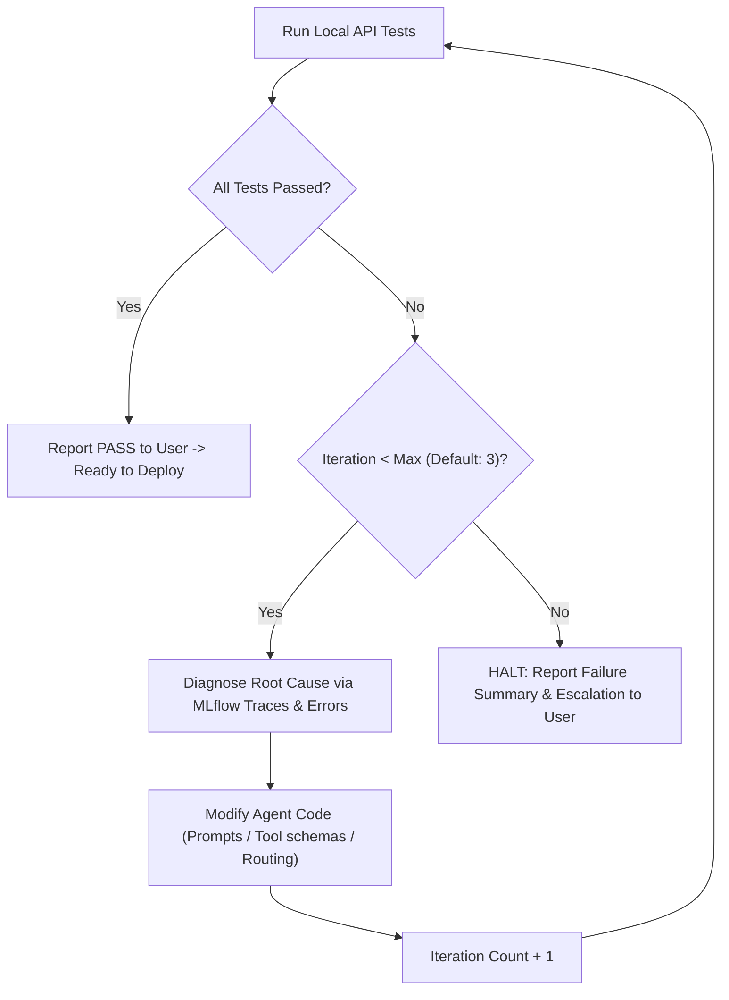

# Local Testing, Self-Correction Loop, and Deployment Guide

This guide details the local validation, automated API testing, bounded self-correction loop, and production deployment process for Databricks Agent Bricks agents.

---

## 1. Local Testing Architecture (`agentbricks dev`)

When you run `agentbricks dev`:
- It invokes `databricks apps run-local` under the hood.
- Uses `uv` to build and manage an isolated virtual environment (`.venv/`).
- Spawns a local HTTP server (default: `http://localhost:8000`) serving both the REST API endpoint (`/invocations`) and the web Chat UI.
- Directs MLflow tracing to a local SQLite-backed server (`.agentbricks/mlruns`), allowing you to inspect trace steps without polluting cloud experiments.
- Connects to Databricks model serving endpoints (AI Gateway) automatically using the credentials from your configured `.env` (`DATABRICKS_CONFIG_PROFILE`).

---

## 2. Default Local API Test Cases

The test runner (`scripts/run_local_api_test.py`) automatically detects whether the target server uses the **Agent Bricks Durable runtime** (`/api/invocations`) or a **Standard Model Serving runtime** (`/invocations`) and formats payloads accordingly. It executes 5 core test categories:

| Test Case | Detected Endpoint | Objective | Success Criteria |
| :--- | :--- | :--- | :--- |
| **1. Health & Readiness** | `GET /` | Ensure server is up and accepting connections | HTTP 200/404 received without network timeout |
| **2. Conversational Quality** | `POST /api/invocations` or `/invocations` | Check response payload formatting | HTTP 200 with non-empty assistant messages or output string |
| **3. Session Continuity** | `POST /api/invocations` or `/invocations` | Verify multi-turn memory with same `session_id` | Fact provided in Turn 1 is accurately recalled in Turn 2 |
| **4. Error & Edge Handling** | `POST /api/invocations` or `/invocations` | Test malformed/empty payload resilience | Returns HTTP 4xx (400/422) gracefully, never HTTP 500 |
| **5. Tool Execution** | `POST /api/invocations` or `/invocations` | Test bound tools (UC functions, Sandbox, etc.) | Tool invoked without exceptions, results synthesized in response |

### Payload Conventions:
- **DurableAgentServer (`/api/invocations`)**:
  ```json
  {
    "id": "<invocation-uuid>",
    "input": {
      "session_id": "<session-id>",
      "messages": [{"role": "user", "content": "..."}]
    }
  }
  ```
- **Model Serving / Custom FastAPI (`/invocations`)**:
  ```json
  {
    "session_id": "<session-id>",
    "messages": [{"role": "user", "content": "..."}]
  }
  ```

### Running the Test Suite:
```bash
# Run tests against default local server (auto-detects endpoint)
python .agents/skills/databricks-native-agent/scripts/run_local_api_test.py --url http://localhost:8000

# Run with custom domain queries (e.g. testing specific tools)
python .agents/skills/databricks-native-agent/scripts/run_local_api_test.py \
  --custom-query "Calculate quarterly growth from the finance summary table" \
  --custom-query "Look up customer details for ID 1042"

# Output structured JSON for automated parsing
python .agents/skills/databricks-native-agent/scripts/run_local_api_test.py --json --project <project_name>
```

`--project` runs an **identity check first**: it fails if the process on the port runs from a different directory,
if the agent does not report the project's `@tool` functions, or if it still reports the template sample tools
(`get_current_time`, `send_message`) that the project removed. Without it, a stale server from another agent
can satisfy all four generic tests. Pair it with `--custom-query` cases that exercise your real tools.


---

## 3. Bounded Self-Correction Loop

To maintain autonomy while preventing infinite loops, the agent follows strict loop bounding rules:



### Self-Correction Loop Rules:
1. **Iteration Limit**: Set a hard upper bound of **3 iterations** (configurable up to 5 for complex graphs).
2. **Diagnosis Checklist**:
   - **Schema Mismatch**: Does the tool output shape match what LangGraph / OpenAI SDK expects?
   - **Prompt Hallucination / Omission**: Does the system prompt clearly describe when and how to call the tool?
   - **Session State Loss**: Is `thread_config(session_id, actor)` properly passed into graph execution?
   - **Timeout**: Did the model serving call or tool execution exceed timeout thresholds?
3. **Escalation Protocol**:
   When the iteration limit is reached:
   - Provide a structured report:
     - Exact failed test cases.
     - Hypotheses tested and attempted fixes in each iteration.
     - Suspected root causes (e.g., missing Unity Catalog permissions, unavailable external MCP service, model instruction drift).
   - Ask for user guidance before making further changes.

---

## 4. Production Deployment to Databricks Apps (`agentbricks deploy`)

Deploying packages your local agent into a production Databricks App:

```bash
# Basic deploy
agentbricks --profile <profile> deploy <app_name>

# Deploy specifying instance count (with sticky session routing)
agentbricks --profile <profile> deploy <app_name> --instances 2

# Deploy with User-delegated (OBO) authentication permissions
agentbricks --profile <profile> deploy <app_name> --allow-user-scope-update
```

### Behind-the-Scenes Actions of `deploy`:
1. **Store Reconciliation**:
   - Creates the Lakebase-backed Managed Memory Store if declared.
   - Creates the Lakebase-backed Session Store if declared.
2. **Tracing Experiment Creation**:
   - Creates or links the MLflow Experiment path in Unity Catalog (`/Users/.../agentbricks-...`).
3. **Identity & Security (Service Principal)**:
   - Provisons the Databricks App Service Principal (SP).
   - Grants the SP read/write access to the managed memory and session stores.
4. **App Build & Compute Rollout**:
   - Syncs code to Databricks Apps runtime.
   - Builds environment via `uv`.
   - Waits for compute status to transition from `STARTING` to `ACTIVE`.
5. **URL Issuance**:
   - Outputs the hosted web URL (`https://<app-name>-<hash>.databricksapps.com`).

---

## 5. Post-Deployment Verification

Verify production health and live tracing:

```bash
# Check deployment compute state
agentbricks deployments get agent-bricks-<app_name>

# Stream live production logs
agentbricks deployments logs agent-bricks-<app_name> --follow

# Invoke live cloud endpoint via CLI
agentbricks endpoint invoke /invocations \
  --data '{"messages": [{"role": "user", "content": "Ping"}]}'

# Open MLflow tracing in Databricks Workspace
# Workspace -> Experiments -> /Users/<user>/agentbricks-<app_name>
```
